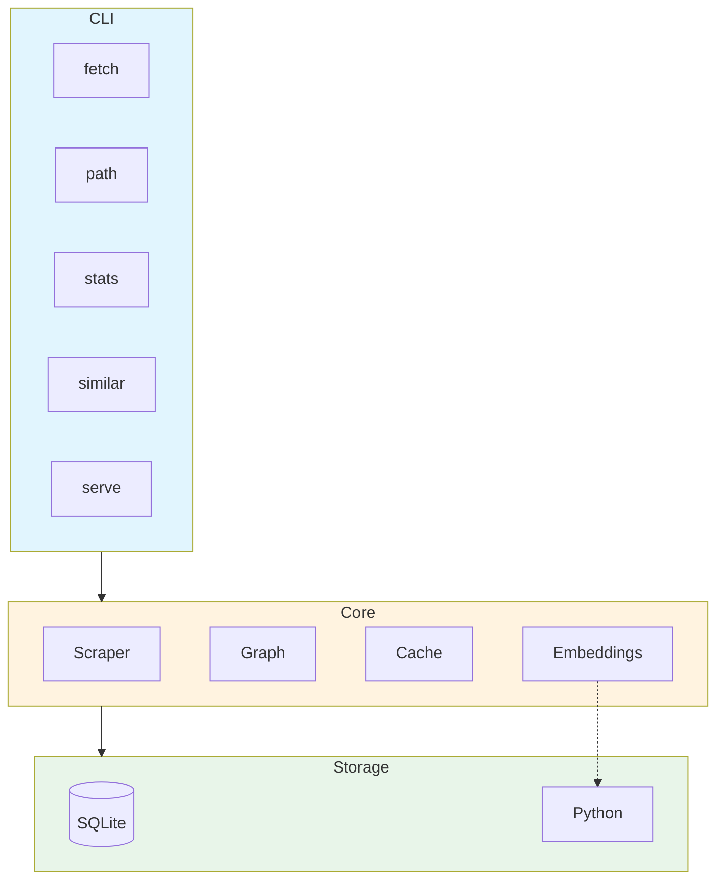

# WikiGraph

[](https://go.dev/)
[](LICENSE)

A tool that crawls Wikipedia, builds a knowledge graph of connections between people, places, and events, and lets users explore relationships through pathfinding and semantic similarity.

## Status

Under development - Phase 2 (Graph & Pathfinding) Complete

## Features

- **Wikipedia Scraping**: Fetch and parse Wikipedia pages with intelligent caching
- **Knowledge Graph**: Build a navigable graph of Wikipedia's internal links
- **Pathfinding**: Find the shortest path between any two Wikipedia articles
- **Semantic Similarity**: Discover related pages using word embeddings
- **Interactive Visualization**: Explore the graph through a web interface
- **REST API**: Programmatic access to all functionality

---

## Quick Start

### Prerequisites

- Go 1.22+
- Python 3.10+ (for embeddings service, coming in Phase 3)
- Docker & Docker Compose (optional, for containerized setup - coming later)

### Building

**Windows (PowerShell):**
```powershell
.\scripts\build.ps1 build
```

**Linux/macOS:**
```bash
make -f scripts/Makefile build
```

Or use Go directly:
```bash
go build -o wikigraph.exe ./cmd/wikigraph
```

### Running

**Windows (PowerShell):**
```powershell
.\scripts\build.ps1 run
```

**Linux/macOS:**
```bash
make -f scripts/Makefile run
```

Or use Go directly:
```bash
go run ./cmd/wikigraph
```

---

## Usage

### CLI Commands

```bash
# Fetch Wikipedia pages and extract links
wikigraph fetch "Albert Einstein"
wikigraph fetch "Physics" "Mathematics" --depth 2
wikigraph fetch "Computer Science" --depth 3 --max-pages 100

# View cache statistics
wikigraph stats

# Find shortest path between two pages
wikigraph path "Albert Einstein" "Physics"
wikigraph path "Cat" "Dog" --max-depth 10
wikigraph path "Go (programming language)" "Python" --bidirectional
wikigraph path "A" "B" --format json
```

### CLI Commands (Planned - Future Phases)

```bash
# Find semantically similar pages (Phase 3)
wikigraph similar "World War II"

# Start the API server (Phase 4)
wikigraph serve --port=8080
```

### API Endpoints (Planned)

| Endpoint | Method | Description |
|----------|--------|-------------|
| `/health` | GET | Health check |
| `/page/:title` | GET | Fetch a page and its links |
| `/path` | GET | Find shortest path between pages |
| `/connections/:title` | GET | Get N-hop neighborhood |
| `/similar/:title` | GET | Find semantically similar pages |
| `/crawl` | POST | Trigger a background crawl |

---

## Architecture



---

## Project Structure

```
wikigraph/
├── cmd/
│   └── wikigraph/
│       ├── main.go           # CLI entry point (Cobra)
│       ├── root.go           # Root command and global flags
│       ├── fetch.go          # Fetch command
│       ├── path.go           # Path command
│       └── stats.go          # Stats command
├── internal/
│   ├── cache/                # Repository layer for pages/links
│   ├── config/               # Configuration management (Viper)
│   ├── database/             # SQLite database wrapper
│   ├── fetcher/              # Wikipedia HTTP fetching (Colly)
│   ├── graph/                # Graph construction and pathfinding
│   │   ├── graph.go          # Graph data structure
│   │   ├── loader.go         # Load graph from cache
│   │   └── pathfinder.go     # BFS and bidirectional search
│   ├── parser/               # HTML link extraction (goquery)
│   ├── scraper/              # BFS crawl orchestration
│   ├── api/                  # HTTP handlers and routing (Phase 4)
│   └── embeddings/           # Embeddings client (Phase 3)
├── migrations/
│   └── 001_initial_schema.sql
├── python/                   # Embeddings microservice (Phase 3)
│   ├── main.py
│   └── requirements.txt
├── scripts/                  # Build scripts (Makefile, build.ps1)
├── docs/                     # Documentation
├── go.mod
└── README.md
```

---

## Configuration

### Environment Variables (Planned)

| Variable | Default | Description |
|----------|---------|-------------|
| `WIKIGRAPH_DB_PATH` | `./data/wikigraph.db` | SQLite database path |
| `WIKIGRAPH_PORT` | `8080` | API server port |
| `WIKIGRAPH_RATE_LIMIT` | `1s` | Delay between Wikipedia requests |
| `WIKIGRAPH_CACHE_TTL` | `168h` | Cache time-to-live (7 days) |
| `WIKIGRAPH_EMBEDDINGS_URL` | `http://localhost:8001` | Embeddings service URL |

---

## Development

### Prerequisites

```bash
# Install development tools (optional)
go install github.com/golangci/golangci-lint/cmd/golangci-lint@latest
go install github.com/air-verse/air@latest
```

### Commands

**Windows (PowerShell):**
```powershell
# Build
.\scripts\build.ps1 build

# Run
.\scripts\build.ps1 run

# Test
.\scripts\build.ps1 test

# Clean
.\scripts\build.ps1 clean
```

**Linux/macOS:**
```bash
# Build
make -f scripts/Makefile build

# Run
make -f scripts/Makefile run

# Test
make -f scripts/Makefile test

# Clean
make -f scripts/Makefile clean
```

### Running Tests

```bash
# Unit tests
go test ./...

# With coverage
go test -cover ./...

# Integration tests (requires network)
go test -tags=integration ./...

# Benchmarks
go test -bench=. ./internal/scraper/
```

---

## Tech Stack

| Component | Technology |
|-----------|------------|
| Backend | Go 1.22+ |
| CLI Framework | Cobra |
| Configuration | Viper |
| Logging | slog (stdlib) |
| Web Framework | Gin |
| Web Scraping | Colly |
| Database | SQLite (modernc.org/sqlite) |
| Embeddings | Python, FastAPI, sentence-transformers |
| Frontend | Cytoscape.js |
| Containerization | Docker |

---

## License

This project is licensed under the MIT License - see [LICENSE](LICENSE) for details.
